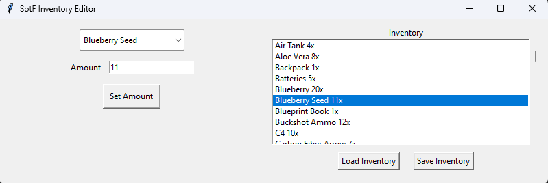

# SotF Inventory Editor
Sons of the Forest Inventory Editor in Python with tkinter GUI.

# How to Use
Run `python3 sotf_invedit.py`

Load an inventory using the "Load Inventory" button from your save files.  
Save files are usually located at `C:/Users/%USERNAME%/AppData/LocalLow/Endnight/SonsOfTheForest/Saves/`  
Select the `PlayerInventorySaveData.json` file in the Multiplayer, MultiplayerClient or SinglePlayer subfolder.

To save you just use the "Save Inventory" button the same way.  
**I highly suggest backing up your previous save file before overwriting it.**

# Screenshot

