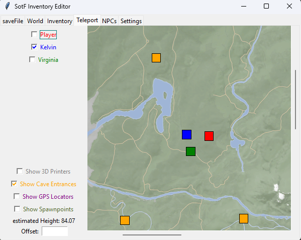
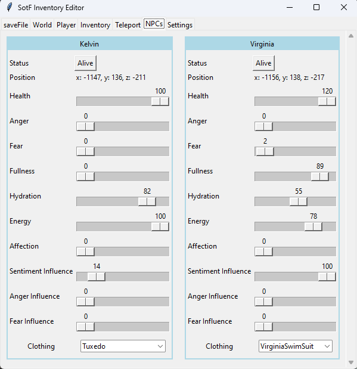

# Sons of the Forest Save File Editor
Written in Python with tkinter GUI.

# How to Use
Run `python3 sotf_invedit.py`

You can find your save files at `C:/Users/%USERNAME%/AppData/LocalLow/Endnight/SonsOfTheForest/Saves/`  
Select the Multiplayer, MultiplayerClient or SinglePlayer subfolder in the dialog.

**I highly recommend backing up your previous save file before overwriting it.**

# Screenshots

